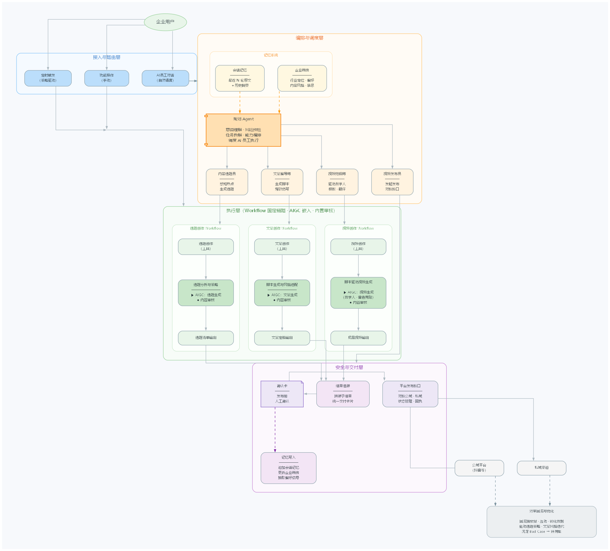
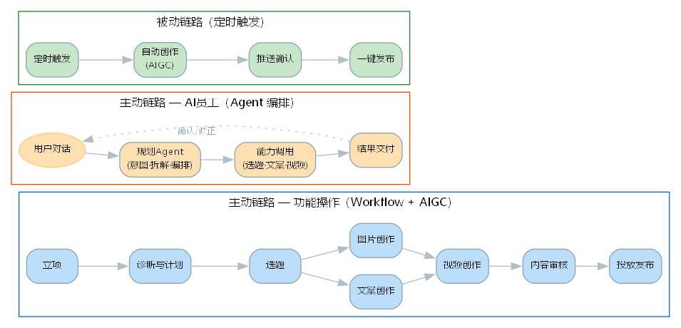

1. ## 产品概述

本产品是AI营销增长平台，服务对象为企业，覆盖流量增长、客资转化两大类任务

系统包含几条独立链路

- **产品主链路**：企业流量操盘手通过功能链路操作主流程，企业立项 → 诊断与计划 → 确定选题 → 文案创作/图片创作 → 视频创作 → 投放发布，不同环节使用不同的workflow、AIGC能力实现从0到1的内容生产投放
- **主动操作链路**
  - **选题创作链路**：企业主经过立项使系统掌握企业主行业定位等信息，系统每天感知时间、网络环境变化交付灵感结果并结合企业定位，从热点类（事实、行业、人物、时间）、专业知识类、观点嘴替类交付灵感结果——各类选题
  - **文案创作链路**：企业用户选择合适选题发起文案创作请求，系统根据方法论生成各类风格脚本文案内容，或用户通过系统监控同行业爆款视频的能力，选择其中爆款视频进行脚本结构拆解后，实现衍生仿写或改写
  - **视频创作链路**：①以音色克隆与数字人克隆为基础、结合脚本文案进行创作，包含直接视频创作、模板视频/画中画创作、视频语言翻译获得成果
  - **人才市场AI员工集成链路**：
    - **内容选题员/文案编导师/视频剪辑员/视频发布员**：企业用户以自然语言形式发起对话，结合企业用户行业信息，系统实时理解意图、规划步骤、编排能力与工具调用，主要以两种方式①适配系统内置工具②<u>**必要时调用执行段端openclaw进入抖音等公域平台获取相关优质内容改进内容，（老师点评/建议：这里可能需要关注具体怎么进入）**</u> 最终自动调起各平台发布实现投放

- **被动操作链路**
  - **定时工具开启：** 系统自动根据公域/私域的类型分类进行内容创作，并将结果推送给企业用户，企业用户确认后可一键发布

架构上采用Workflow+AIGC+Agent编排，Workflow与AIGC构成产品基础能力，能够实现内容稳定产出，AI员工作为以规划Agent为决策中枢，能力节点为其编排的 LLM 调用，决策不同方向工具的调用。

2. ## 需求分析

### 2.1 项目背景

每个企业都需要获客，获客离不开营销与增长，即使产品做得好，酒香也怕巷子深，然而多数企业主为做好营销投入巨大的人力物力财力是仍然得不到好的结果，且面临3个核心问题：

**其一，获客成本高**。**获客成本给企业带来压力：** 市场竞争激烈，获客成本持续上升，企业营销预算吃紧，利润空间被压缩，制约了增长与扩张；**传统营销方式效果不佳：** 广告投放、人力物力投入巨大，但转化有限。客户获取效率低，成本居高不下

**其二，转化效率低**。**潜在客户流失严重**：吸引有余，转化不足——营销不精准、产品不匹配，造成客户大量流失；**营销与销售衔接不畅：** 营销脱节、销售断层一部门协同不足影响整体转化

**其三，内容产能不足**。**内容创作难度大：** 优质内容创作需要投入大量时间与人力，涵盖文案、设计、拍摄等环节，多数企业缺乏专业团队，导致内容产能不足、创作效率低；**内容更新不及时：** 在信息爆炸时代，用户对新鲜、有趣内容的需求激增，内容更新慢，会导致客户兴趣流失，影响品牌曝光与转化

本项目旨在通过高质量精准内容创作、极速内容创作、低成本内容生成以及AI员工团队构成的AI营销增长平台，让企业用户无需投入高成本营销费用、无需自己从各大平台寻找爆款营销内容并深度分析、无需自身亲身参与拍摄，即可完成个人IP视频创作，实现流量转化、客资转化。

### 2.2 用户场景与痛点

**场景一：获客成本高**

**场景二：转化效率低**

**场景三：内容产能不足**

### 2.3 为什么用大模型 / Agent

上述痛点，正是传统获客形式带来的副作用，要想能得到大幅度且有效的改进，必须结合Workflow、AIGC与Agent，分别承担稳定执行、内容生成和动态决策等任务。

**其一，产品已具备内容生产能力，Agent 在此基础上叠加意图理解层，让用户更容易驱动这些能力**。用户无需在各功能模块之间自行理解和串联操作，只需通过自然语言表达目标，Agent 自动理解意图、拆解任务、编排已有能力并完成执行。

**其二，固定链路可覆盖标准化内容生产，但企业实际营销任务多变且非标，Agent 补上动态规划这块空白**。不同企业的行业定位、目标人群和发布平台各不相同，有的只需仿写一篇文案，有的需要从热点选题一路做到多平台发布。这些非标需求无法用固定流程穷举，Agent 在运行时动态规划步骤、灵活编排工具，让复杂多变的需求能被灵活接住。

<u>（老师建议：对于其一和其二，这个套的不太对，AIGC能力是AI时代带来的新机会与新产物，是趋势）</u>

**其三，内容生产和营销判断高度依赖大模型。** 选题策划、热点判断、爆款拆解、文案创作、脚本改写和平台风格适配，均属于自然语言生成与软判断任务，适合由大模型完成。

**其四，营销链路涉及多个能力和工具，需要 Agent 统一编排。** Agent 可作为决策中枢，调用大模型、数字人、音色克隆、视频剪辑、网络搜索及平台发布等能力，实现从内容策划到生产投放的协同执行。

**其五，** Workflow、AIGC 与 Agent 结合，能够兼顾稳定性与灵活性。Workflow 负责固化文案生成、视频合成、内容审核等明确环节，保证过程稳定；AIGC 负责具体内容生产；Agent 负责任务理解、步骤规划、能力选择和工具调用，使平台既能稳定交付，又能适应不同企业和营销场景。

### 2.4 需求价值测算

#### 2.4.1 定性测算（新体验 vs 旧体验 vs 替换成本）

新体验的核心价值，是将原本分散在选题策划、文案创作、图片设计、视频制作和平台发布等多个环节的工作，整合为一套可持续运行的 AI 营销生产链路。

旧体验下，企业需要自行组建内容团队，或分别使用多个创作工具，并依赖人工完成热点查找、内容策划、脚本撰写、视频制作和平台发布，生产周期长、协作成本高，且内容质量受人员能力影响较大。

新体验下，企业既可以通过固定 Workflow 稳定完成内容生产，也可以直接向 AI 员工描述营销目标，由 Agent 自动理解需求、规划步骤并调用相应能力完成任务。企业无需替换现有营销团队和业务系统，可将平台作为新增的内容生产与营销执行工具按需使用，因此学习成本和迁移成本较低。

#### 2.4.2 定量测算

以一家月产 100 条营销短视频的中小企业为测算基准。

---

**一、成本侧：平台运营成本（我们花多少）**

| 成本项 | 单价 | 说明 |
|--------|------|------|
| 大模型选题、文案及内容分析 | ¥2/条 | 各Agent的LLM调用 |
| 图片、数字人、音频及视频生成 | ¥8/条 | AIGC图片、数字人渲染、TTS及视频合成 |
| 搜索、存储、任务调度及基础设施 | ¥2/条 | 搜索API、OSS存储、GPU调度 |

- 单条运营成本＝¥12/条，企业月运营成本＝100×¥12＝¥1,200/月
- 计入重生成、模型波动及人工审核损耗（约20%～30%），单企业综合运营成本取 **¥3,000/月**

---

**二、销售定价（我们卖多少）**

按次套餐制，三档套餐，均为 **1年有效期**：

| 版本 | 内容条数 | 价格 | 折合单价 | 目标客户 |
|------|----------|------|----------|----------|
| 标准版 | 300条 | ¥24,999 | ≈¥83/条 | 小微企业、个人IP |
| 专业版 | 600条 | ¥44,999 | ≈¥75/条 | 中小企业（主力） |
| 尊享版 | 1,200条 | ¥79,999 | ≈¥67/条 | 成长型企业、多账号运营 |

定价逻辑：客户自产单条综合成本约 ¥300，即使按标准版 ¥83/条计算，客户每条仍节省 ¥217；量大从优（¥83→¥75→¥67），鼓励选择高版本。公司侧单条成本 ¥12，毛利率 76%～86%。

---

**三、客户收益侧 & 公司营收侧**

以一家月产 100 条（年需 1,200 条）的中小企业选择 **尊享版（¥79,999/年）** 为测算基准：

| 维度 | 指标 | 年度 |
|------|------|------|
| **客户投入** | 套餐费用 | ¥79,999 |
| **客户收益** | 内容生产成本节省（替掉 ¥300×1,200＝¥36万） | ¥280,001 |
| | 新增成交营收（年增840条×3客资×3%成交×¥2,000） | ¥151,200 |
| | **客户年净收益** | **¥431,201** |
| | **客户投产比** | **约 5.4:1** |
| **公司收入** | 套餐收入 | ¥79,999 |
| **公司成本** | 平台运营成本（1,200条×¥12＋损耗冗余） | ≈¥36,000 |
| | **单客户毛利（毛利率 55%）** | **¥43,999** |

**规模推演**（均按尊享版估算）：

| 阶段 | 累计客户 | 累计收入 | 累计毛利 |
|------|----------|----------|----------|
| MVP试点（第1-3月） | 10家 | ≈¥80万 | ≈¥44万 |
| 早期增长（第4-6月） | 40家 | ≈¥320万 | ≈¥176万 |
| 规模增长（第7-12月） | 100家 | ≈¥800万 | ≈¥440万 |

关键经营指标：客单价 ¥2.5万～¥8万，毛利率 ≥55%，复购率（到期续费）≥70%，LTV/CAC ≥ 3:1。

---

以上测算均为模型假设值，成本单价、定价、产能、客资及成交率等参数需在MVP试点中结合实际数据校准。

### 2.5 产品目标与核心指标

**北极星指标：企业月有效营销内容发布量**

定义为企业在一个自然月内，通过平台完成创作，并实际发布至公域或私域平台的营销内容数量。一次完整发布计为一条有效营销内容，单独生成选题、文案、图片或未发布的视频不重复计算。

选择该指标作为北极星，是因为本产品的核心价值不是单纯调用功能或生成中间内容，而是帮助企业持续产出并发布能够用于营销获客的内容。只有内容真正完成生产并进入投放环节，后续的流量增长、客资获取和成交转化才有实现基础。

MVP 阶段目标：试点企业月均发布有效营销内容各平台总总共不少于 30 条，具体目标根据企业规模和内容发布频率校准。

围绕北极星，设置三层支撑指标。

**一、使用与生产效率指标（衡量“用得起来、产得出来”）**

- 企业月活跃使用率：一个自然月内完成至少一次有效任务的企业数占企业总数的比例，目标 ≥60%。
- 企业周活跃使用率：一周内完成至少一次有效任务的企业占比，用于观察平台是否进入企业日常营销工作。
- 人均周有效任务数：企业用户每周完成的选题、文案、视频及发布任务数量，建立基线后逐月提升。

**二、内容质量与任务质量指标（衡量“产得好、用得上”）**

- 任务完成率：任务成功生成完整结果的比例，目标 ≥90%。
- 内容发布率：生成内容中实际发布至公域或私域平台的比例，目标 ≥50%。
- 一次生成可用率：首次生成后，用户未重新生成，且仅进行少量文字、素材或参数调整便进入发布环节的内容占比，目标 ≥60%。通过重新生成次数、编辑幅度及是否发布等系统行为综合判断。
- 内容安全通过率：生成内容通过平台敏感词和内容安全检测的比例，目标 ≥95%；同时持续跟踪因内容不当导致的发布失败、内容下架或账号处罚情况，并不断优化检测与审核能力。

**三、业务价值指标（衡量“带来流量和客资增长”）**

- 内容产能提升率：企业使用平台后，月均营销内容数量相较使用前的提升比例。
- 有效客资增长率：企业使用平台后，月有效客资数量相较使用前的增长比例，MVP 阶段目标提升 ≥20%。
- 客资转化率：有效客资中最终完成咨询、留资或成交的比例，建立基线后持续提升。

指标之间的关系为：内容质量和任务质量决定企业是否愿意采用和发布，使用与生产效率决定企业能否持续生产内容，有效内容的持续投放进一步带来流量、客资和成交增长，最终形成“质量提升→持续使用→内容投放→流量获客→客资转化”的价值传导链。

### 2.6 范围与非目标（MVP）

**在范围内**：支持企业立项、营销诊断与计划、选题生成、文案创作、图片与视频创作、内容审核及平台发布等核心链路；支持热点、专业知识、观点嘴替等选题生成；支持爆款内容获取、结构拆解与仿写改写；支持数字人、音色克隆、模板视频及视频翻译；支持企业用户通过自然语言调用内容选题员、文案编导师、视频剪辑员和视频发布员，由 Agent 完成意图理解、任务规划和工具编排；支持公域、私域定时内容生成、结果推送及人工确认后发布；涉及外部平台操作和正式发布时，保留人工确认。

**非目标**：MVP 不承诺生成内容必然成为爆款或直接带来成交；不完全替代企业营销人员对品牌定位、内容方向和最终发布结果的判断；不在未经用户确认的情况下自动对外发布内容；不保证完全避免平台违规、内容下架或账号处罚，敏感词和内容安全检测仅作为风险辅助；不覆盖广告投放预算管理、智能出价及投流优化；不直接负责客户跟进、销售沟通和最终成交；不同企业之间的数据、素材和生成结果严格隔离。

3. ## 整体方案

### 3.1 系统架构

**架构定位**：产品采用 **Workflow + AIGC + Agent 编排**，架构分为四层——接入与路由层、编排与调度层、执行层、安全与交付层。Workflow 与 AIGC 构成执行层基础能力，实现内容稳定产出；Agent 位于编排层，规划Agent 集成了意图理解、风险预检、任务拆解与能力编排，统一调度 AI 员工执行。两条核心处理路径：功能操作经接入层直通 Workflow 固定链路（选题→文案→图片→视频）；自然语言经接入层进入规划Agent，由 Agent 编排 AI 员工调用 AIGC 能力完成。所有对外内容统一经安全与交付层审核确认后发布。

**整体架构图**：

**核心链路图**：

**模块职责与类型划分**：

| 模块 | 类型 | 所属层 | 职责 |
|------|------|--------|------|
| 规划 Agent | Agent（决策中枢） | 编排与调度层 | 意图理解、风险预检、任务拆解、能力编排；加载会话记忆与企业画像作为上下文；调度 AI 员工执行 |
| 内容选题员 | Agent | 编排与调度层 | 结合企业定位、热点感知与行业知识库，交付选题方向；接受规划 Agent 调度 |
| 文案编导师 | Agent | 编排与调度层 | 生成脚本文案；检索爆款模板库进行结构拆解与仿写；接受规划 Agent 调度 |
| 视频剪辑师 | Agent | 编排与调度层 | 驱动数字人/音色克隆生成视频；支持模板视频、画中画、视频翻译；接受规划 Agent 调度 |
| 视频发布员 | Agent | 编排与调度层 | 发起发布请求，经审核确认后驱动平台发布接口执行 |
| 会话记忆 | 确定性代码 + LLM 摘要 | 编排与调度层 | 按会话存储全量轮次；超阈值触发滚动摘要（保留最近N轮原文+历史摘要）；30min无交互归档 |
| 企业画像 | 确定性代码 + LLM 抽取 | 编排与调度层 | 沉淀企业行业定位、内容偏好、品牌风格、禁忌话题；归档时自动抽取；冲突保留双值待确认 |
| 选题创作 Workflow | 确定性代码 + AIGC 节点 | 执行层 | 固定链路：选题创作 → 选题分析与策略（AIGC：选题生成，内置审核）→ 选题清单输出 |
| 文案创作 Workflow | 确定性代码 + AIGC 节点 | 执行层 | 固定链路：文案创作 → 脚本生成与风格适配（AIGC：文案生成，内置审核）→ 文案定稿输出 |
| 视频创作 Workflow | 确定性代码 + AIGC 节点 | 执行层 | 固定链路：视频创作 → 脚本驱动视频生成（AIGC：视频生成 + 数字人·音色克隆，内置审核）→ 成品视频输出 |
| 结果组装 | 确定性代码 | 安全与交付层 | 按执行计划拼装子结果为统一交付卡片；含高风险标记时生成确认卡并锁定 |
| 确认卡 | 确定性代码 | 安全与交付层 | 发布前须经人工确认；确认后驱动发布接口并解除状态锁 |
| 平台发布接口 | 确定性代码 | 安全与交付层 | 对接抖音等公域平台及私域渠道；含重试与失败通知；管理发布状态与回执 |
| 记忆写入 | 确定性代码 + LLM 抽取 | 安全与交付层 | 交付后追加会话记忆；抽取沟通要点写入企业画像；记录编辑行为为偏好信号 |
| 效果回流 | 确定性代码 + 人工分析 | 反馈回路 | 回流播放量、互动、转化等平台数据；驱动选题策略与文案风格迭代；Bad Case 进评测集 |

**架构选型说明：为什么是 Workflow + AIGC + Agent，而不是纯 Workflow 或纯 Agent**

其一，营销内容生产需要稳定交付，Workflow 不可替代。选题→文案→视频→发布的标准化链路是企业批量生产内容的核心，固定流程保证每一步可控、可复现，这是纯 Agent 自由规划无法保证的。

其二，固定链路无法覆盖所有场景，Agent 补上灵活编排能力。当企业需求超出标准链路（如"帮我分析这个爆款、仿写一篇、用我的数字人出片发抖音"），Agent 在运行时动态组合能力节点，不依赖预设流程。

其三，AIGC 承担内容生成，Agent 承担决策编排，Workflow 承担稳定执行，三者职责清晰、边界明确。未来可将任一能力节点单独升格为拥有自主循环的 Agent，无需整体重构。
