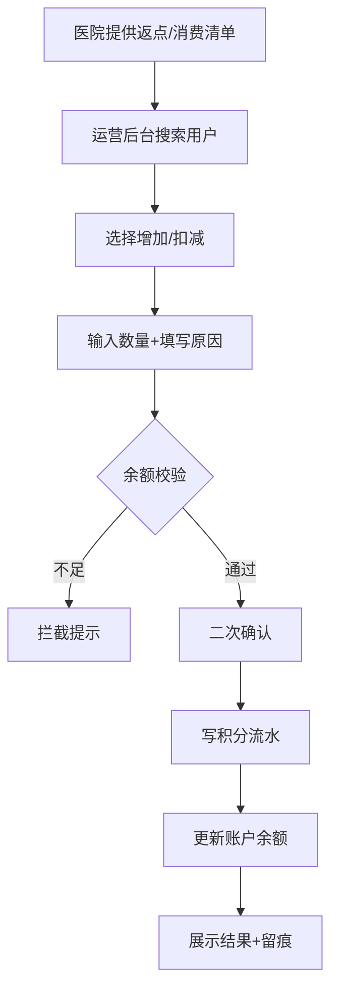
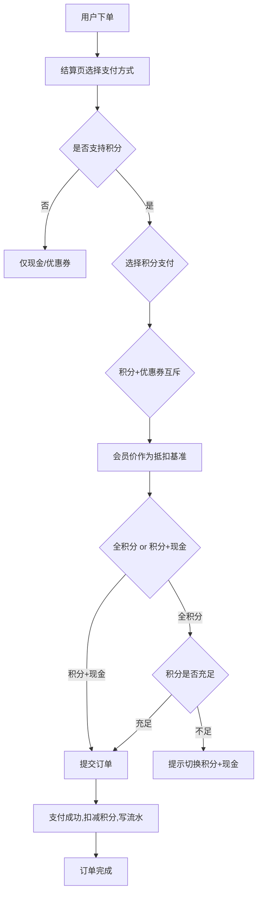

# B1 业务流程图 — 积分体系

## 一、积分发放流程

```mermaid
flowchart TD
  A[医院提供返点/消费清单] --> B[运营后台搜索用户]
  B --> C[选择增加/扣减]
  C --> D[输入数量+填写原因]
  D --> E{余额校验}
  E -- 不足 --> F[拦截提示]
  E -- 通过 --> G[二次确认]
  G --> H[写积分流水]
  H --> I[更新账户余额]
  I --> J[展示结果+留痕]
```

## 二、积分消费流程

```mermaid
flowchart TD
  A[用户下单] --> B[结算页选择支付方式]
  B --> C{是否支持积分}
  C -- 否 --> D[仅现金/优惠券]
  C -- 是 --> E{选择积分支付}
  E --> F{积分+优惠券互斥}
  F --> G[会员价作为抵扣基准]
  G --> H{全积分 or 积分+现金}
  H -- 全积分 --> I{积分是否充足}
  I -- 充足 --> J[提交订单]
  I -- 不足 --> K[提示切换积分+现金]
  H -- 积分+现金 --> J
  J --> L[支付成功,扣减积分,写流水]
  L --> M[订单完成]
```

## 三、角色参与

| 流程 | 参与角色 |
|------|----------|
| 积分发放 | 运营（操作）、财务（核对）、系统（记账） |
| 积分消费 | 用户（发起）、系统（校验/记账） |
