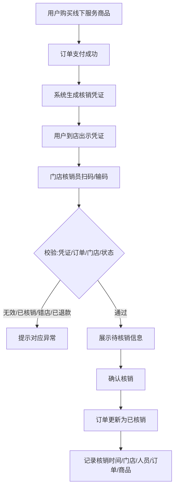

# B1 业务流程图 — 门店核销

## 一、核销主流程

## 二、角色参与

| 流程 | 参与角色 |
|------|----------|
| 凭证生成 | 系统（自动） |
| 到店核销 | 用户（出示）、门店核销员（执行）、系统（校验/记录） |
| 记录查询 | 后台运营 |

## 三、异常分支

- 扫码失败 → 手动输码兜底。
- 任何校验不通过 → 拦截并提示，不进入确认核销。
