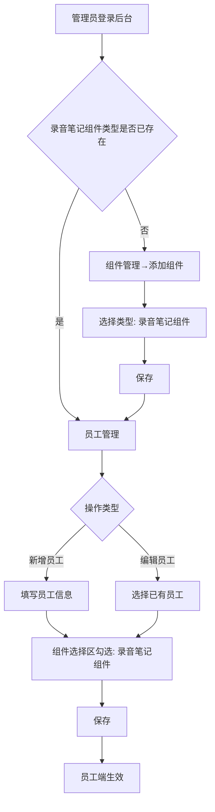
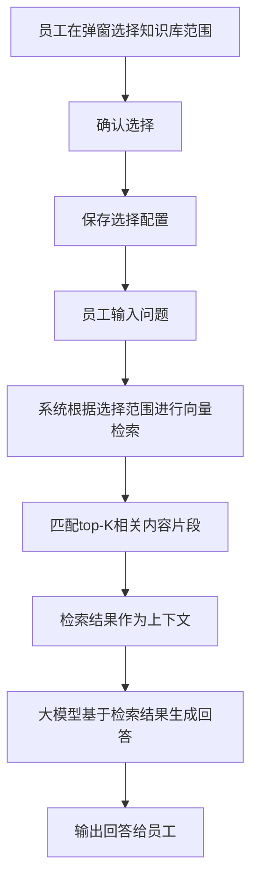

# PRD 产品需求文档 — 录音笔记组件（含知识库转换与 RAG 检索）

> 本文档是研发交付的总装文档。包含两个模块：
> - **模块一**：录音笔记组件基础版（v0.1）——将录音笔记知识库内容作为对话上下文
> - **模块二**：知识库转换 + 对话检索升级（v0.2）——转换为向量化知识库，支持 RAG 检索
>
> 模块二是对模块一中 F2（知识库选择弹窗）和 F3（对话上下文注入）的升级替换。

---

## A1. 需求背景（改动概述）

### 模块一背景（v0.1）

- **改动前**：元梦客 PC 端员工对话已有多个对话组件（新话题、上传文件等），应用中心已有「录音笔记」功能（含知识库和录音文件）。录音笔记与员工对话是两个独立模块。
- **改动后**：在员工对话组件区新增「录音笔记」组件，用户可在对话前选择录音笔记知识库/文件，将录音总结内容作为 AI 对话上下文。
- **改动原因**：录音笔记中已积累大量业务录音内容，但员工无法在对话中直接引用这些内容。接入后员工可基于录音内容进行 AI 问答，提升录音内容的业务价值。

### 模块二背景（v0.2）

- **当前问题**：模块一将录音总结文本直接注入对话上下文，存在两个局限：① 录音文本量大时超出上下文窗口；② 无法精准检索录音中的特定内容片段。
- **已有能力**：系统已有「资产管理 → 知识库管理」功能，支持创建向量化知识库，可用于智能体/员工对话时进行内容检索（RAG）。
- **改动内容**：
  1. 新增「录音笔记知识库 → 正式知识库」的转换能力，支持向量化检索
  2. 录音笔记内容变更时自动同步更新正式知识库
  3. 员工对话组件选择对象从"录音笔记知识库"改为"已转换的正式知识库"
  4. 对话上下文从"全文注入"升级为"动态向量检索（RAG）"
- **改动原因**：让录音内容真正可检索、可精准匹配，提升 AI 回答的准确性和效率。

---

## A2. 需求目标

### 模块一目标（v0.1）

- **目标 1**：员工能在对话前选择录音笔记知识库，将录音总结内容作为 AI 对话上下文，完成基于录音内容的智能问答。
- **目标 2**：管理员能在后台配置录音笔记组件类型，并控制哪些员工可使用该组件。

### 模块二目标（v0.2）

- **目标 3**：将录音笔记知识库转换为支持向量化检索的正式知识库，使录音内容可被精准检索。
- **目标 4**：员工对话中的组件选择升级为"正式知识库范围选择"，对话时基于 RAG 动态检索相关内容。
- **目标 5**：录音笔记内容变更后自动同步到正式知识库，保证检索内容的时效性。

### 不做会怎样

- **模块一不做**：员工需要手动复制粘贴录音总结文本进入对话，操作链路长、易出错。
- **模块二不做**：全文注入模式下，录音内容多时超出上下文窗口限制，AI 回答质量下降，无法精准定位录音中的特定信息。

---

## A3. 用户角色与使用场景

| 角色   | 画像描述                                | 核心诉求                                       |
| ------ | --------------------------------------- | ---------------------------------------------- |
| 员工   | 使用元梦客 AI 员工对话的一线业务人员    | 希望引用已录制的业务录音内容进行 AI 分析和问答 |
| 管理员 | 后台配置元梦客员工和组件的运营/管理人员 | 需要为特定员工开启/关闭录音笔记组件能力        |

| 场景               | 用户   | 触发条件                     | 行为路径                                              | 期望结果                           |
| ------------------ | ------ | ---------------------------- | ----------------------------------------------------- | ---------------------------------- |
| 对话中引用录音内容 | 员工   | 员工需要基于历史录音内容提问 | 进入对话→点击录音笔记组件→选择知识库→确认→开始AI对话  | AI 基于选中的录音总结内容进行回复  |
| 配置员工组件       | 管理员 | 新员工入职或需要调整组件权限 | 进入后台→员工管理→新增/编辑员工→勾选录音笔记组件→保存 | 员工在对话页可见并使用录音笔记组件 |
| 添加新组件类型     | 管理员 | 系统首次需要录音笔记组件类型 | 进入后台→组件管理→添加组件→选择"录音笔记组件"类型     | 录音笔记组件可用                   |

---

## A4. 功能范围

### 模块一 P0（v0.1）

| 编号 | 功能                       | 说明                                                 |
| ---- | -------------------------- | ---------------------------------------------------- |
| F1   | PC 端录音笔记组件入口      | 员工对话页组件区新增按钮，点击弹出知识库选择弹窗     |
| F2   | 知识库选择弹窗（v0.1版）   | 展示员工有权限的知识库/文件，0个/全部/N个/1个库时展开文件 |
| F3   | 对话上下文注入（全文模式）  | 将选中知识库的录音总结文本作为对话上下文             |
| F4   | 后台组件类型——录音笔记组件 | 组件管理可添加"录音笔记组件"类型                     |
| F5   | 后台员工组件配置           | 新增/编辑员工时可勾选录音笔记组件                    |

### 模块二 P0（v0.2）【本次新增】

| 编号 | 功能                       | 说明                                                       |
| ---- | -------------------------- | ---------------------------------------------------------- |
| F6   | 知识库转换——一键全部转换   | 录音笔记-知识库管理页新增"一键转换全部知识库"按钮          |
| F7   | 知识库转换——单个转换       | 每个录音笔记知识库新增"转换为知识库"按钮                   |
| F8   | 知识库持续同步             | 录音笔记内容变更后自动同步更新对应正式知识库               |
| F9   | 知识库选择弹窗（v0.2升级） | 改为选择已转换的正式知识库；手风琴模式，每个库可独立展开文件；支持跨知识库组合选择 |
| F10  | 对话 RAG 检索              | 对话时基于选中的知识库范围进行向量检索，匹配相关内容作为上下文 |

> ⚠️ **模块二 F9 替换模块一 F2**，模块二 F10 替换模块一 F3。

### 本期不包含

| 内容                      | 原因                 |
| ------------------------- | -------------------- |
| 录音笔记知识库的创建/管理 | 已有录音笔记模块功能 |
| 录音总结内容生成          | 已有录音笔记模块负责 |
| 原始音频播放              | 需求明确使用总结文本 |
| 其他内容类型的组件接入    | 未来需求             |
| 移动端                    | 需求限定 PC 端       |
| 文本切片策略自定义        | 复用资产管理-知识库管理的默认策略 |
| Embedding 模型选型        | 复用已有向量化基础设施 |

---

## A5. 功能说明

### F1. 录音笔记组件入口

**【本次新增】**

**功能描述**：在员工对话页组件区（对话框上方）新增「录音笔记」组件按钮。

**组件位置**：与已有组件（新话题、上传文件等）并列，位于对话框上方组件区域。

**组件样式**：

- 图标 + 文字标签"录音笔记"
- 选中状态：按钮高亮，显示当前选择摘要（如"全部知识库"、"3个知识库"、"知识库A"）
- 未选中状态：默认样式，标签"录音笔记"

**按钮文案规则**：

| 选择场景 | 按钮显示 |
|----------|----------|
| 未选择过（首次使用） | 录音笔记 |
| 0 个知识库 | 录音笔记 |
| 全部知识库 | 录音笔记 · 全部知识库 |
| N 个知识库（N>1） | 录音笔记 · N 个知识库 |
| 1 个知识库 + 全部文件 | 录音笔记 · [知识库名称] |
| 1 个知识库 + N 个文件 | 录音笔记 · [知识库名称] · N 个文件 |

**交互规则**：

- 点击按钮 → 弹出知识库选择弹窗（F2）
- 已选择知识库后，按钮显示选中态和当前选择摘要（持续生效，直到员工重新选择）
- 【当前假设】组件按钮的图标样式与已有组件风格保持一致

---

### F2 / F9. 知识库选择弹窗（v0.2 升级）

**【本次修改】** 替换 v0.1 的样式A/B切换模式，升级为左右双栏布局 + 跨库组合选择。

**功能描述**：弹出模态弹窗，左栏展示知识库列表（含转换状态图标），右栏展示选中知识库的文件列表。支持跨知识库组合选择。

**选择对象变更**：【本次修改】从"录音笔记知识库"改为"已转换为正式知识库（具有向量化检索能力）"，仅已转换的知识库可勾选。

**弹窗结构**：

```
┌──────────────────────────────────────────────────────┐
│  选择知识库                                🔍 搜索    │
│  ────────────────────────────────────────────────── │
│  ☑ 全选                                              │
│  ┌─────────────────────┬───────────────────────────┐ │
│  │ 知识库列表           │  文件列表                  │ │
│  │                     │                           │ │
│  │☑ 知识库A (12)   ✓  │ ☑ 全选                    │ │
│  │☑ 知识库B (8)    ✓  │ ☑ 文件1  07-20 会议       │ │
│  │☐ 知识库C (5)    ✗  │ ☑ 文件2  07-19 客户       │ │
│  │☑ 知识库D (20)   ✓  │ ☐ 文件3  07-18 讨论       │ │
│  │                     │                           │ │
│  └─────────────────────┴───────────────────────────┘ │
│  已选：知识库A(2个文件) + 知识库B+D(全部文件)          │
│  [取消]                                [确认选择]     │
└──────────────────────────────────────────────────────┘
```

**左右双栏交互规则**：

| 操作 | 行为 |
|------|------|
| 点击左栏知识库行 | 右侧切换为该知识库的文件列表 |
| 勾选左栏知识库复选框 | 选中/取消该知识库（含其下全部文件） |
| 勾选右栏文件复选框 | 单独选中/取消该文件 |
| 右栏「全选」 | 仅作用于当前展示的知识库，全选/取消其下全部文件 |
| 顶部「全选」 | 选中/取消所有已转换知识库 |

**知识库选择规则**：

| 规则 | 说明 |
|------|------|
| 展示范围 | 【已确认】展示所有录音笔记知识库，仅已转换的可勾选 |
| 转换状态图标 | 已转换=绿色勾(✓)，未转换=红色叉(✗)，未转换的知识库不可勾选 |
| 默认选择 | 【已确认】默认全选所有已转换的知识库 + 全部文件 |
| 0 个知识库 | 【已确认】允许不选择任何知识库，确认后不携带检索上下文 |
| 搜索过滤 | 按知识库名称模糊匹配，保持已选状态 |
| 搜索+全选 | 搜索过滤态下顶部「全选」仅作用于当前过滤结果 |
| 触底加载 | 知识库列表和文件列表超出可视区域时触底加载，不分页 |
| 点击名称可勾选 | 点击知识库名称或文件名的文字区域可切换勾选状态 |

**跨知识库组合选择规则**：

支持同时选择多个知识库，每个知识库独立选择文件范围。右栏展示当前激活知识库的文件，切换知识库不丢失已选状态。

**底部提示规则**：

| 选择情况 | 底部提示文案 |
|---------|-------------|
| 0 个知识库 | 不选择知识库 |
| 全部知识库 + 全部文件 | 全部知识库 · 全部文件 |
| N个知识库 + 全部文件 | N个知识库 · 全部文件 |
| N个知识库 + M个文件（跨库组合） | N个知识库 · M个文件 |

**选择持久化**：

- 【已确认】每次新建对话时，默认继承上次选择的知识库/文件配置
- 首次使用时默认全部已转换的知识库 + 全部文件

---

### F3 / F10. 对话上下文注入 → RAG 检索（v0.2 升级）

**【本次修改】** 从"全文注入模式"升级为"RAG 向量检索模式"。

**v0.1 模式（模块一）**：【保持不变，作为降级方案】将选中知识库的录音总结文本全文注入对话上下文。

**v0.2 模式（模块二）**：【本次新增】基于选中的知识库范围进行向量检索。

**RAG 检索流程**：

```
用户输入问题
    ↓
根据选择范围确定检索目标（知识库/文件）
    ↓
向量检索匹配相关内容片段（top-K）
    ↓
检索结果作为上下文提供给大模型
    ↓
AI 基于检索结果生成回答
```

**检索规则**：

| 规则 | 说明 |
|------|------|
| 检索范围 | 用户在弹窗中选择的知识库和文件范围 |
| 检索方式 | 向量相似度匹配 |
| 结果数量 | 【当前假设】默认返回 top-5 相关内容片段 |
| 内容来源 | 正式知识库中已完成向量化的文档切片 |
| 降级策略 | 正式知识库不可用时，回退到 v0.1 全文注入模式 |

**上下文展示**：

- 【当前假设】对话界面显示当前检索范围来源（如"检索范围：知识库B、知识库D 共15个文件"）

---

### F6. 知识库转换——一键全部转换

**【本次新增】**

**功能描述**：将录音笔记中所有知识库批量转换为正式知识库。

**操作路径**：应用中心 → 录音笔记 → 知识库管理 → 「一键转换全部知识库」

**交互规则**：
- 按钮位置：知识库列表上方操作区
- 点击后弹出二次确认弹窗："确认将所有录音笔记知识库转换为正式知识库？转换后可在员工对话中进行向量检索。"
- 确认后开始批量转换，列表显示转换进度
- 【当前假设】转换过程异步执行，不阻塞用户其他操作

**转换后**：
- 【已确认】录音笔记知识库继续作为录音数据存储来源，持续接收 APP 端录音内容更新
- 正式知识库作为员工对话使用的知识库，支持向量化检索
- 资产管理-知识库管理中可见，标注来源"录音笔记"
- 【已确认】转换后的知识库默认打上「录音笔记」标签

---

### F7. 知识库转换——单个转换

**【本次新增】**

**功能描述**：将单个录音笔记知识库转换为正式知识库。

**操作路径**：应用中心 → 录音笔记 → 知识库管理 → 每个知识库卡片上的「转换为知识库」按钮

**交互规则**：
- 每个知识库卡片/行显示「转换为知识库」按钮
- 已转换的知识库按钮变为「已转换」标签（不可点击）
- 转换中的知识库显示「转换中…」+ 进度指示

**转换状态**：

| 状态 | 展示 | 操作 |
|------|------|------|
| 待转换 | 「转换为知识库」按钮 | 可点击 |
| 转换中 | 「转换中…」+ 进度条 | 不可点击 |
| 已转换 | 「已转换」标签 + 「同步中/已同步」 | 不可点击 |
| 转换失败 | 「重试」按钮 + 错误提示 | 可重试 |

---

### F8. 知识库持续同步

**【本次新增】**

**功能描述**：录音笔记内容变更后，自动同步更新对应的正式知识库。

**触发条件**：
- APP 新增录音
- 录音内容更新
- 录音总结内容更新

**同步流程**：

```
录音笔记内容变化
    ↓
检测关联的正式知识库
    ↓
更新正式知识库文档内容
    ↓
重新处理文本切片
    ↓
更新向量数据
    ↓
保证员工对话检索最新内容
```

**同步规则**：

| 规则 | 说明 |
|------|------|
| 触发方式 | 【当前假设】自动触发，无需手动操作 |
| 同步粒度 | 【当前假设】增量同步，仅更新变更的文档 |
| 同步状态 | 知识库列表展示同步状态：已同步 / 同步中 / 同步失败 |
| 同步失败处理 | Toast 提示，提供手动同步入口 |

**正式知识库与录音笔记知识库的关系**：

```
APP录音内容
      ↓
录音笔记知识库（内容存储层）
      ↓ 转换 + 同步更新
正式知识库（向量检索层）
      ↓
员工/智能体对话检索
```

> 【已确认】录音笔记知识库继续作为录音数据存储来源，正式知识库作为检索层。双方保持同步。

---

### F3. 对话上下文注入（v0.1，已被 F10 替换）

> ⚠️ 本章节为 v0.1 原始设计，已被 F3/F10（RAG检索模式）替换。保留作为降级方案参考。

**【v0.1 设计】**

**功能描述**：用户确认知识库/文件选择后，系统将对应的录音总结内容注入对话上下文，使 AI 可以基于这些内容进行回复。

**上下文数据来源**：

- 【现有功能】录音笔记模块提供的录音总结文本内容
- 仅注入文本总结内容，不注入原始音频

**注入范围**：

- 选中的知识库 → 该库下全部文件的总结内容
- 选中的文件（单库模式下）→ 指定文件的总结内容
- 选择 0 个知识库 → 不注入录音笔记内容，直接进行常规 AI 对话

**AI 对话行为**：

- 对话携带上述内容作为上下文
- 用户提问时，AI 基于上下文中的录音总结内容进行回答
- 【当前假设】上下文注入方式与现有对话上下文的处理方式一致（如已有的文件上传等组件使用相同的上下文注入机制）

**上下文展示**：

- 【当前假设】对话界面可能显示当前上下文来源（如"基于录音笔记：知识库A、知识库B"），让用户清楚 AI 的回答依据

---

### F4. 后台组件类型——录音笔记组件

**【本次新增】**

**功能描述**：后台组件管理功能中，新增"录音笔记组件"作为可选组件类型。

**操作路径**：后台 → 组件管理 → 添加组件

**变更点**：组件类型下拉选项中新增一项「录音笔记组件」

**组件配置**：

- 组件名称：录音笔记组件（预设，管理员可修改）
- 组件类型标识：【本次新增】`recording_note`
- 组件图标：【当前假设】使用预设图标，管理员可上传自定义图标
- 其他配置项复用已有组件管理表单

---

### F5. 后台员工组件配置

**【本次新增】**

**功能描述**：在员工管理中，新增/编辑员工时可配置录音笔记组件。

**操作路径**：

- 后台 → 员工管理 → 新增员工 → 组件选择区 → 勾选「录音笔记组件」
- 后台 → 员工管理 → 编辑员工 → 组件选择区 → 勾选/取消勾选「录音笔记组件」

**变更点**：员工组件配置选项中新增「录音笔记组件」

**配置规则**：

- 管理员可在新增员工时勾选录音笔记组件
- 管理员可在编辑员工时添加或移除录音笔记组件
- 勾选后，该员工在对话页可见并使用录音笔记组件
- 取消勾选后，该员工对话页不显示录音笔记组件
- 【当前假设】组件配置实时生效，无需员工重新登录

---

## A6. 页面与交互说明

### P1. PC 端员工对话页（改动页）

**页面概览**：

| 项目     | 内容                         |
| -------- | ---------------------------- |
| 页面名称 | 员工对话页                   |
| 页面路径 | 【待确认】当前员工对话页路由 |
| 改动类型 | 新增组件按钮 + 新增弹窗      |
| 影响区域 | 对话框上方组件区             |
| 使用角色 | 员工                         |
| 接入方式 | PC Web                       |

**页面结构草图（ASCII Wireframe）**：

```
┌─────────────────────────────────────────────────────────┐
│  ← 返回          员工AI对话                     [设置]   │  ← 顶部栏
├─────────────────────────────────────────────────────────┤
│                                                         │
│  ┌─────────────────────────────────────────────────┐   │
│  │ [新话题] [上传文件] [录音笔记▼] [更多···]        │   │  ← 组件区（新增录音笔记）
│  └─────────────────────────────────────────────────┘   │
│                                                         │
│  ┌─────────────────────────────────────────────────┐   │
│  │                                                 │   │
│  │             AI 对话消息区域                       │   │  ← 对话区
│  │                                                 │   │
│  │  AI：你好，我是你的AI助手...                      │   │
│  │  用户：帮我分析一下上周的客户会议录音              │   │
│  │  AI：[基于录音内容回复]                           │   │
│  │                                                 │   │
│  └─────────────────────────────────────────────────┘   │
│                                                         │
│  ┌─────────────────────────────────────────────────┐   │
│  │  输入你想问的问题...                   [发送]     │   │  ← 输入区
│  └─────────────────────────────────────────────────┘   │
│                                                         │
│  ┌─── 知识库选择弹窗（模态） ─────────────────────┐    │
│  │  选择知识库                          🔍 搜索     │    │
│  │  ────────────────────────────────────────────  │    │
│  │  ☑ 全选                                         │    │
│  │  ┌──────────────┬────────────────────────────┐ │    │
│  │  │ 知识库列表    │  文件列表（知识库A）        │ │    │
│  │  │☑ 知识库A ✓  │ ☑ 全选                      │ │    │
│  │  │☑ 知识库B ✓  │ ☑ 文件1  07-20 会议         │ │    │
│  │  │☐ 知识库C ✗  │ ☑ 文件2  07-19 客户         │ │    │
│  │  │☑ 知识库D ✓  │ ☐ 文件3  07-18 讨论         │ │    │
│  │  └──────────────┴────────────────────────────┘ │    │
│  │  已选：知识库A(2个文件) + 知识库B+D(全部文件)     │    │
│  │  [取消]                         [确认选择]       │    │
│  └────────────────────────────────────────────┘    │
└─────────────────────────────────────────────────────────┘
```

**页面元素说明**：

| 元素            | 类型          | 说明                      | 交互                              |
| --------------- | ------------- | ------------------------- | --------------------------------- |
| 录音笔记按钮    | Button        | 组件区新增按钮，图标+文字 | 点击打开弹窗；已选时高亮+显示选择摘要 |
| 弹窗标题        | Text          | "选择录音笔记知识库"      | —                                 |
| 搜索框          | Input(Search) | 按知识库名称搜索          | 输入关键词实时过滤列表            |
| 全选复选框      | Checkbox      | 一键全选/取消全选         | 点击切换全部知识库选中状态        |
| 知识库列表(左栏) | Checkbox List | 知识库名称 + 文件数量 + 转换状态图标(✓/✗) | 点击行切换右栏文件列表；勾选复选框选中知识库 |
| 文件列表(右栏)   | Checkbox List | 文件名 + 日期 + 总结状态  | 展示当前激活知识库的文件，支持全选/单选 |
| 底部提示        | Text          | 显示当前选中状态摘要      | 动态更新                          |
| 取消按钮        | Button(次要)  | —                         | 关闭弹窗，不保存更改              |
| 确认按钮        | Button(主要)  | —                         | 保存选择，关闭弹窗，注入上下文    |

**页面交互说明**：

| 交互          | 触发                    | 系统行为                                                   |
| ------------- | ----------------------- | ---------------------------------------------------------- |
| 打开弹窗      | 点击「录音笔记」按钮    | 加载员工有权限的知识库列表，回填上次选择                   |
| 搜索知识库    | 在搜索框输入文字        | 实时过滤知识库列表，保持已选状态                           |
| 全选/取消全选 | 点击「全选」复选框      | 所有知识库同步切换选中状态                                 |
| 切换激活知识库 | 点击左栏知识库行        | 右栏切换为该知识库的文件列表                            |
| 勾选知识库    | 点击知识库行复选框      | 选中/取消该知识库及其下全部文件                          |
| 全选当前知识库 | 点击右栏「全选」复选框   | 仅作用于右栏当前展示的知识库，全选/取消其下全部文件      |
| 勾选文件      | 点击文件复选框或文件名  | 更新已选文件，底部提示同步更新                             |
| 确认选择      | 点击「确认选择」        | 关闭弹窗，保存选择（知识库+文件组合范围），按钮切换为选中态 |
| 取消选择      | 点击「取消」或弹窗外    | 关闭弹窗，恢复上次保存的选择                               |
| 重新选择      | 点击已选中态的按钮      | 打开弹窗，回显当前配置                                     |

**页面状态说明**：

| 状态           | 触发条件                         | 表现                                                              |
| -------------- | -------------------------------- | ----------------------------------------------------------------- |
| 首次使用       | 员工从未选择过录音笔记           | 按钮显示默认样式；点击后弹窗默认全选                              |
| 已选择         | 员工上次已确认选择               | 按钮高亮显示，按规则显示摘要（如"全部知识库"、"3个知识库"、"知识库A · 5个文件"） |
| 弹窗加载中     | 弹窗打开，知识库列表请求中       | 弹窗内显示 Loading 骨架/加载动画                                  |
| 弹窗空状态     | 员工在录音笔记中无任何知识库权限 | 弹窗内显示空状态插图和文案"暂无可用知识库"，底部提示"不选择知识库"，可确认 |
| 弹窗搜索无结果 | 搜索关键词无匹配知识库           | 列表区显示"未找到匹配的知识库"                                    |
| 弹窗异常       | 知识库接口请求失败               | Toast 提示"加载失败，请重试"，弹窗内显示重试按钮                  |
| 上下文加载异常 | 确认选择后总结内容获取失败       | Toast 提示"录音内容加载失败"，不影响对话，但上下文中无对应内容    |

---

### P2. 后台-组件管理页（改动页）

**页面概览**：

| 项目     | 内容                             |
| -------- | -------------------------------- |
| 页面名称 | 组件管理页                       |
| 页面路径 | 【待确认】当前后台组件管理页路由 |
| 改动类型 | 组件类型选项中新增一项           |
| 影响区域 | 添加组件表单 → 组件类型下拉选项  |
| 使用角色 | 管理员                           |

**变更内容**：

- 【现有功能】添加组件表单 → 组件类型下拉框
- 【本次新增】下拉选项中新增「录音笔记组件」

**交互**：与其他已有组件类型的添加流程一致，无特殊交互。

---

### P3. 后台-员工管理页（改动页）

**页面概览**：

| 项目     | 内容                             |
| -------- | -------------------------------- |
| 页面名称 | 员工管理页（新增/编辑员工表单）  |
| 页面路径 | 【待确认】当前后台员工管理页路由 |
| 改动类型 | 组件选择区新增可选项             |
| 影响区域 | 新增/编辑员工表单 → 组件选择区   |
| 使用角色 | 管理员                           |

**变更内容**：

- 【现有功能】新增/编辑员工表单中的组件选择区（Checkbox 列表）
- 【本次新增】选项中新增「录音笔记组件」
- 管理员勾选→员工端显示该组件，取消勾选→员工端不显示该组件

**交互**：与其他已有组件的勾选配置流程一致，无特殊交互。

---

### P4. 录音笔记-知识库管理页（改动页）【本次新增】

**页面概览**：

| 项目     | 内容                             |
| -------- | -------------------------------- |
| 页面名称 | 录音笔记-知识库管理页            |
| 页面路径 | 【待确认】应用中心 → 录音笔记 → 知识库管理 |
| 改动类型 | 新增转换功能按钮 + 状态标签      |
| 影响区域 | 知识库列表上方操作区 + 每个知识库卡片/行 |
| 使用角色 | 员工                             |

**变更内容**：
- 【本次新增】知识库列表上方「一键转换全部知识库」按钮
- 【本次新增】每个知识库卡片/行右侧「转换为知识库」按钮
- 【本次新增】知识库转换状态标签（待转换/转换中/已转换/同步中/转换失败）

**页面结构草图**：

```
┌──────────────────────────────────────────────────────────┐
│  录音笔记 > 知识库管理                                    │
│  ─────────────────────────────────────────────────────── │
│  [一键转换全部知识库]                                     │  ← 新增按钮
│  ─────────────────────────────────────────────────────── │
│  ┌─────────────────────────────────────────────────┐    │
│  │ AI录音纪要    128个文件    已转换 ✓  同步中 ⟳   │    │  ← 状态标签
│  └─────────────────────────────────────────────────┘    │
│  ┌─────────────────────────────────────────────────┐    │
│  │ 客户沟通记录  45个文件     [转换为知识库]        │    │  ← 转换按钮
│  └─────────────────────────────────────────────────┘    │
│  ┌─────────────────────────────────────────────────┐    │
│  │ 销售拜访      89个文件     转换中… ████████░░   │    │  ← 进度条
│  └─────────────────────────────────────────────────┘    │
│  ┌─────────────────────────────────────────────────┐    │
│  │ 项目复盘      17个文件     转换失败 ⚠ [重试]     │    │  ← 重试按钮
│  └─────────────────────────────────────────────────┘    │
└──────────────────────────────────────────────────────────┘
```

**页面元素说明**：

| 元素 | 类型 | 说明 |
|------|------|------|
| 一键转换全部 | Button(主要) | 点击弹出二次确认弹窗，确认后批量转换 |
| 转换为知识库 | Button(次要) | 单个知识库转换入口 |
| 转换状态标签 | Tag | 待转换/转换中/已转换/同步中/转换失败 |
| 重试按钮 | Button(文字) | 转换失败时显示，点击重新转换 |
| 二次确认弹窗 | Modal | "确认将所有录音笔记知识库转换为正式知识库？" |

**交互**：
- 一键转换 → 二次确认弹窗 → 确认 → 批量异步转换 → 列表刷新状态
- 单个转换 → 直接触发转换 → 按钮切换为进度状态
- 转换完成后自动变为"已转换"标签

## A7. 字段与规则说明

### 新增字段

| 字段         | 所属     | 类型                        | 必填 | 说明                                     |
| ------------ | -------- | --------------------------- | ---- | ---------------------------------------- |
| 组件类型标识 | 组件管理 | 枚举值新增 `recording_note` | 是   | 【本次新增】标识该组件为录音笔记组件     |
| 员工组件绑定 | 员工管理 | 关联关系新增                | 否   | 【本次新增】员工与录音笔记组件的绑定关系 |
| 员工选择配置 | 员工对话 | JSON 对象                   | 否   | 【本次新增】存储员工上次的知识库/文件选择，结构见下方 |
| 知识库转换状态 | 录音笔记 | 枚举值新增 | 是   | 【本次新增】`pending` / `converting` / `done` / `syncing` / `failed` |
| 正式知识库关联ID | 录音笔记 | 关联关系新增 | 否   | 【本次新增】转换后关联的资产管理-正式知识库ID |
| 同步状态 | 录音笔记 | 枚举值新增 | 否   | 【本次新增】`synced` / `syncing` / `sync_failed` |

**员工选择配置数据结构（v0.2 升级）**：

| 字段 | 类型 | 说明 | 示例 |
|------|------|------|------|
| employee_id | string | 员工ID | "emp_001" |
| kb_file_map | object | 知识库ID → 文件ID数组的映射。空数组=选中该库全部文件。`{}`=0个知识库 | `{"kb_01":["file_001","file_002"],"kb_02":[]}` |
| is_all_kb | boolean | 是否选中全部已转换知识库（快捷标记，用于全选/取消全选） | true |
| updated_at | timestamp | 最后更新时间 | 1753632000000 |

> **规则说明**：`kb_file_map` 的 key 仅为已勾选的知识库ID。value=空数组 `[]` 表示该知识库下全部文件。value=`["file_001"]` 表示仅该文件。未出现在 map 中的知识库=未勾选。

### 录音笔记文件对象字段定义

| 字段 | 类型 | 说明 | 示例 |
|------|------|------|------|
| file_id | string | 文件ID | "file_001" |
| file_name | string | 文件名 | "客户A项目需求沟通" |
| recording_date | date | 录音日期 | "2026-07-25" |
| kb_id | string | 所属知识库ID | "kb_01" |
| summary_status | enum | 总结状态：`done` / `processing` / `empty` | "done" |
| summary_text | string | 总结内容（仅 summary_status=done 时可用） | "本次会议讨论了..." |

> **规则**：文件列表中 `summary_status=empty` 的文件显示为灰色/不可勾选，hover 提示"暂无可用的总结内容"；`summary_status=processing` 的文件显示为灰色 + "处理中"标签。

### 交互规则汇总

| 规则编号 | 规则                                                            | 来源                                 |
| -------- | --------------------------------------------------------------- | ------------------------------------ |
| R1       | 员工可见知识库范围 = 该员工在录音笔记中的知识库权限范围         | 【已确认】用户确认 Q1                |
| R2       | 弹窗默认全选所有有权限的知识库                                  | 【已确认】用户确认 Q2/Q3             |
| R3       | 每次新建对话时，默认继承上次选择的知识库/文件配置               | 【已确认】用户确认 Q2                |
| R4       | 弹窗采用左右双栏布局：左栏知识库列表，右栏文件列表，点击知识库切换右栏内容 | 【已确认】用户反馈（模块二）             |
| R5       | 跨知识库组合选择：可同时选择多个知识库的不同文件组合                   | 【已确认】用户确认 Q1（模块二）         |
| R6       | 允许不选择任何知识库（0 个），此时不携带检索上下文，直接与 AI 对话     | 【已确认】用户反馈                    |
| R7       | 未在员工管理中勾选录音笔记组件的员工，对话页不显示该组件                | 【当前假设】与其他组件的显隐逻辑一致   |
| R8       | 仅展示已转换为正式知识库的录音笔记知识库，未转换/转换中灰色不可选     | 【已确认】用户确认 Q2（模块二）         |
| R9       | 对话时基于选定知识库范围进行向量检索（RAG），非全文注入               | 【已确认】模块二核心设计               |
| R10      | 录音笔记内容变更后自动触发正式知识库同步更新                          | 【当前假设】自动触发，增量同步         |

---

## A8. 异常情况

| 异常                 | 触发条件                           | 处理                                                                       | 用户提示                                          |
| -------------------- | ---------------------------------- | -------------------------------------------------------------------------- | ------------------------------------------------- |
| 知识库列表加载失败   | 弹窗请求知识库列表接口异常         | 弹窗内展示错误状态，提供重试按钮                                           | "加载失败，请点击重试"                            |
| 录音总结内容获取失败 | 确认选择后请求总结文本接口异常     | 对话正常进行，但上下文中缺少对应的录音内容                                 | Toast："部分录音内容加载失败，可能影响回答完整性" |
| 录音总结内容超过上限 | 选中文件的总总结文本长度超过上下文窗口限制 | 自动截断超出部分，保留可容纳的最大内容量                                   | Toast："部分录音内容因长度限制未完整加载"          |
| 无可用知识库         | 员工在录音笔记中无任何知识库权限   | 弹窗展示空状态，知识库列表为空，底部提示"不选择知识库"，确认按钮仍可用    | "暂无可用知识库"                                  |
| 搜索无结果           | 搜索关键词无匹配知识库             | 知识库列表区域展示空结果                                                   | "未找到匹配的知识库"                              |
| 员工未被分配组件     | 管理员未勾选该员工的录音笔记组件   | 对话页组件区不显示录音笔记按钮                                             | 无提示（不显示）                                  |
| 选择后知识库权限变更 | 管理员修改了员工录音笔记权限       | 【当前假设】下次打开弹窗时刷新权限列表，之前已选但失去权限的知识库自动取消 | 弹窗内提示："部分知识库权限已变更"                |
| 组件切换时未保存     | 用户修改选择但未确认，直接关闭弹窗                       | 恢复到上次确认的选择                                                       | 无提示（静默恢复）                                |
| 知识库已被删除       | 员工上次选择的知识库在录音笔记中被删除                   | 弹窗打开时自动清理无效引用，已删除的知识库不展示                            | Toast："部分知识库已不存在，已自动清除"            |
| 录音总结内容为空     | 选中的文件存在但未生成总结文本（如录音未处理完成）       | 文件在列表中灰色显示/置灰，不可勾选，hover 提示                             | Tooltip："该文件暂无可用的总结内容"                 |
| 触底加载失败         | 滚动触底请求下一页数据时网络超时或接口异常               | 列表底部显示错误提示行，提供"点击重试"链接                                  | "加载失败，点击重试"                              |
| 运行时权限被收回     | 员工正在对话中，管理员取消其录音笔记组件权限或知识库权限 | 【当前假设】组件按钮立即隐藏；已注入的上下文保留到当前对话结束，新对话不再可用 | 对话页按钮消失（无Toast）                         |
| 转换队列满           | 大量知识库同时转换时系统负载过高                       | 新转换请求进入排队队列，提示预计等待时间；单个转换优先于批量转换              | Toast："转换任务已加入队列，预计等待X分钟"         |
| 并发转换冲突         | 一键转换执行中员工点击单个知识库转换                   | 转换中的知识库跳过不重复转换，仅对"待转换"状态的执行                        | 无提示（静默跳过）                                |
| 正式知识库被删除     | 用户在资产管理中删除了已转换的正式知识库               | 录音笔记侧检测到关联知识库不存在→状态回退为"待转换"，允许重新转换            | 状态标签刷新为"待转换"，可再次点击转换            |
| 向量检索无匹配结果   | 选定范围内没有与用户问题相关的内容片段                 | 回退到 v0.1 全文注入模式                                                     | "当前知识库中未找到相关内容，已切换为全文参考模式" |
| 同步时关联知识库已删除 | 录音内容变更时关联的正式知识库已不存在               | 跳过本次同步，状态回退为"待转换"                                            | 知识库状态刷新为"待转换"                          |

---

## A9. 验收标准

### 模块一验收标准（v0.1）

- [ ] **AC1**：员工对话页组件区显示「录音笔记」按钮（仅限已配置该组件的员工）
- [ ] **AC2**：点击录音笔记按钮，弹出知识库选择弹窗，仅展示该员工有权限且已转换的正式知识库
- [ ] **AC3**：弹窗默认全选所有已转换知识库；每个知识库可独立展开/收起文件列表（手风琴模式）；支持跨知识库组合选择
- [ ] **AC4**：确认选择后，对话基于选中的知识库范围进行向量检索（RAG），检索结果作为上下文提供给 AI
- [ ] **AC5**：新建对话时，默认继承上次选择的知识库/文件配置
- [ ] **AC6**：后台组件管理中可选择「录音笔记组件」类型
- [ ] **AC7**：后台新增/编辑员工时可勾选/取消勾选录音笔记组件，保存后员工端即时生效
- [ ] **AC8**：选择 0 个知识库并确认后，对话正常进行但不携带检索上下文
- [ ] **AC9**：知识库列表或文件列表超出弹窗可视区域时，滚动到底部自动触发加载更多（触底加载）

### 模块二验收标准（v0.2）【本次新增】

- [ ] **AC10**：录音笔记-知识库管理页显示「一键转换全部知识库」按钮，点击后弹出二次确认弹窗，确认后批量转换
- [ ] **AC11**：每个录音笔记知识库显示对应的转换状态（待转换/转换中/已转换/转换失败），未转换或转换中的知识库在弹窗中不可选
- [ ] **AC12**：已转换的知识库显示「同步中/已同步」状态，录音笔记内容变更后自动触发同步
- [ ] **AC13**：录音笔记-知识库管理页的转换和同步不阻塞其他操作
- [ ] **AC14**：正式知识库在资产管理-知识库管理中可见，标注来源"录音笔记"，并默认带有「录音笔记」标签

---

## B1. 业务流程图

### 用户端流程

```mermaid
flowchart TD
    A[员工进入对话页] --> B{是否已配置录音笔记组件}
    B -->|否| C[组件区不显示录音笔记]
    B -->|是| D[组件区显示录音笔记按钮]
    D --> E{是否首次使用}
    E -->|是| F[按钮默认态]
    E -->|否| G[按钮显示上次选择]
    F --> H[点击按钮]
    G --> H
    H --> I[弹出知识库选择弹窗]
    I --> J[加载有权限的知识库列表]
    J --> K{加载成功?}
    K -->|否| L[显示错误+重试]
    K -->|是| M{有可用知识库?}
    M -->|否| N[显示空状态]
    M -->|是| O[默认全选回显]
    O --> P[用户调整选择]
    P --> Q{选择数量}
    Q -->|0个| R[样式A: 底部提示"不选择知识库"]
    Q -->|N>1个| S[样式A: 底部提示"N个知识库·全部文件"]
    Q -->|1个| T[样式B: 展开文件列表+底部提示]
    R --> U[点击确认（始终可用）]
    S --> U
    T --> U
    U --> V[保存选择配置]
    V --> W{选择数量>0?}
    W -->|否| AA2[不注入上下文]
    W -->|是| W2[加载录音总结内容]
    W2 --> X{加载成功?}
    X -->|部分失败| Y[Toast提示+部分可用]
    X -->|成功| Z[上下文注入完成]
    Y --> Z
    Z --> AA[员工开始AI对话]
    AA2 --> AA
```

### 后台配置流程



### 知识库转换与同步流程（v0.2新增）

```mermaid
flowchart TD
    A[员工进入录音笔记-知识库管理] --> B{选择转换方式}
    B -->|一键全部转换| C[弹出二次确认弹窗]
    C --> D[确认]
    D --> E[批量异步转换]
    B -->|单个转换| F[点击知识库的转换按钮]
    F --> G[开始单个转换]
    E --> H[创建正式知识库]
    G --> H
    H --> I[文本切片处理]
    I --> J[向量化（Embedding）]
    J --> K[转换完成，更新状态为"已转换"]
    K --> L[正式知识库可被员工对话检索]
    
    M[APP新增/更新录音内容] --> N[录音笔记知识库内容变化]
    N --> O[检测关联的正式知识库]
    O --> P[更新正式知识库文档]
    P --> Q[重新切片+向量化]
    Q --> R[同步完成]
    R --> L
```

### RAG检索对话流程（v0.2新增）



---

## B4. 权限设计

### 角色权限矩阵

| 权限点               | 员工               | 管理员 | 说明                           |
| -------------------- | ------------------ | ------ | ------------------------------ |
| 查看录音笔记组件按钮 | 已配置时可见       | —      | 管理员在后台控制               |
| 打开知识库选择弹窗   | 已配置时可操作     | —      |                                |
| 查看知识库列表       | 与录音笔记权限一致 | —      | 【已确认】仅看到有权限的知识库 |
| 选择知识库/文件      | 可操作             | —      |                                |
| 对话中引用录音内容   | 已选择时可用       | —      |                                |
| 添加组件类型         | —                  | 可操作 | 后台功能                       |
| 配置员工组件         | —                  | 可操作 | 新增/编辑员工时                |

### 权限规则

1. **组件可见性**：【当前假设】员工仅在管理员为其勾选了录音笔记组件后，才能在对话页看到该组件
2. **数据权限**：【已确认】知识库和文件的数据权限与录音笔记模块保持一致，员工只能看到和选择自己有权限的内容
3. **操作权限**：【当前假设】拥有组件权限的员工可自由选择任意有权限的知识库/文件，无额外操作限制
4. **配置权限**：【当前假设】仅管理员角色的账号可访问后台组件管理和员工管理

---

## B6. 风险与依赖

### 依赖列表

| 依赖项                 | 依赖方       | 影响                         | 状态                                     |
| ---------------------- | ------------ | ---------------------------- | ---------------------------------------- |
| 录音笔记知识库列表接口 | 录音笔记模块 | 弹窗无法加载知识库           | 【待确认】需与录音笔记团队确认接口可用性 |
| 录音笔记文件列表接口   | 录音笔记模块 | 单库模式下无法展开文件       | 【待确认】同上                           |
| 录音总结内容读取接口   | 录音笔记模块 | 无法获取对话上下文           | 【待确认】同上                           |
| 录音笔记权限数据       | 录音笔记模块 | 无法获取员工的知识库权限范围 | 【待确认】同上                           |
| 已有组件扩展机制       | 对话系统     | 无法新增组件类型             | 【现有功能】假设已有扩展机制             |
| 后台组件管理功能       | 后台系统     | 无法配置组件                 | 【现有功能】已有功能                     |
| 资产管理-知识库管理    | 资产管理系统 | 无法创建正式知识库           | 【待确认】需确认向量化能力的接口可用性 |
| 向量检索引擎           | AI平台       | 无法进行RAG检索              | 【待确认】需确认检索接口和Embedding模型 |

### 风险列表

| 风险                                 | 影响                        | 概率 | 缓解措施                                           |
| ------------------------------------ | --------------------------- | ---- | -------------------------------------------------- |
| 录音笔记接口不可用或不满足需求       | 阻塞用户端全部功能          | 中   | 提前与录音笔记团队对齐接口，确认数据格式和性能     |
| 录音总结内容过大，影响对话上下文窗口 | 上下文超限，AI 对话质量下降 | 低   | v0.2 升级为 RAG 检索后风险大幅降低                 |
| 组件扩展机制不支持动态新增           | 需要额外开发组件注册能力    | 低   | 提前确认组件机制的扩展性                           |
| 知识库权限体系与对话组件不完全兼容   | 权限数据格式差异影响集成    | 低   | 与录音笔记团队对齐权限数据结构                     |
| 知识库转换耗时过长                   | 大量知识库转换时用户等待久  | 中   | 异步转换 + 进度展示；单个转换可同步返回            |
| 向量化基础设施不可用                 | 阻塞模块二全部功能          | 中   | 提前确认资产管理-知识库管理的向量化接口；保留v0.1全文注入为降级方案 |
| 同步延迟导致检索内容不及时           | 新增录音无法立即被检索      | 中   | 增量同步 + 同步状态展示；用户可手动触发同步        |

---

> **文档版本**：v0.2 | **更新日期**：2026-07-28 | **文档状态**：待确认
>
> 标记说明：【已确认】用户确认的规则 【当前假设】基于合理推断的设计 【待确认】需进一步确认 【现有功能】已有能力 【本次新增】本次改动
